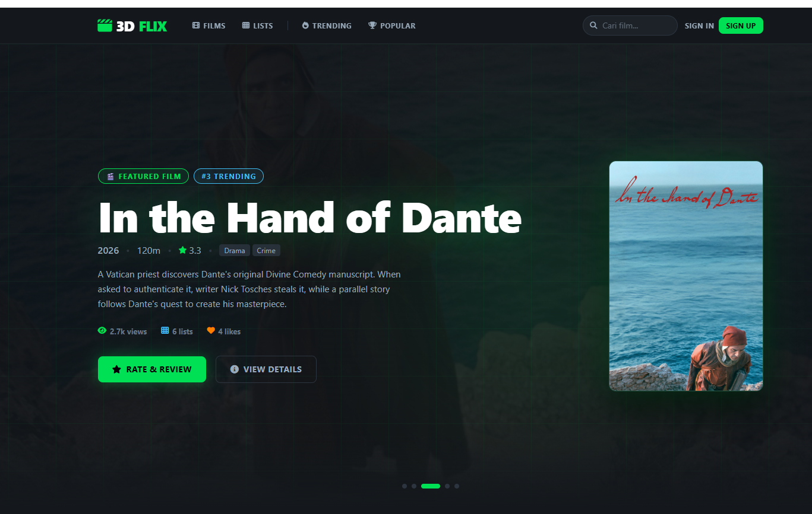
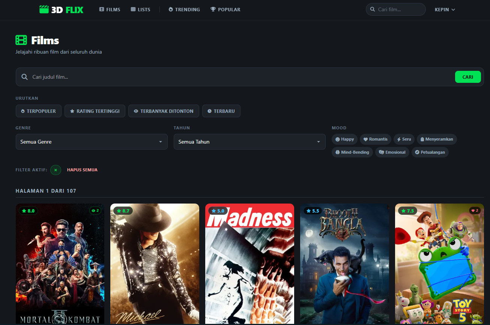
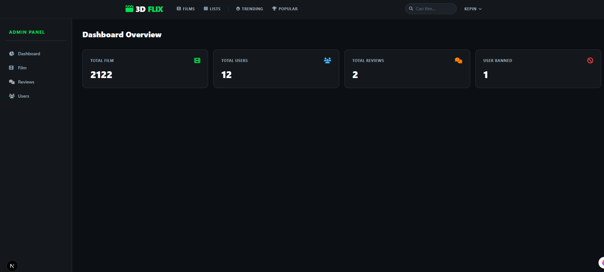

# 3DFLIX

## Deskripsi Singkat
**3DFLIX** adalah website berbasis Next.js yang menyediakan platform bagi pengguna untuk mendapatkan rekomendasi film berdasarkan mood, mencari informasi film, memberikan rating dan ulasan, menyimpan film ke dalam watchlist, serta menyukai film favorit. Data film diperoleh melalui TMDB API, sedangkan data pengguna dan aktivitasnya dikelola menggunakan database MySQL.

---

## Tim, Peran, dan Tanggung Jawab

| Nama | NIM | Peran | Tanggung Jawab |
| :--- | :--- | :--- | :--- |
| LALU ADITYA RAMADHANI | F1D02410063 | **Fullstack Developer** | Merancang dan mengimplementasikan seluruh antarmuka pengguna (UI/UX) yang responsif dan interaktif, membangun API Routes, sistem autentikasi, dan integrasi database. |
| DESWITA SALSABILA | F1D02410004 | **Frontend Developer & UI/UX Designer**| Mendesain dan mengembangkan tampilan antarmuka aplikasi menggunakan Tailwind CSS, membuat halaman yang responsif dan interaktif, serta membantu integrasi frontend dengan API dan sistem autentikasi. |
| ROSIDA ASRI ARDIANI | F1D02410142 |  **Backend Developer** | Membantu pengelolaan database MySQL, watchlist, dan autentikasi pengguna, serta memastikan data tersimpan dengan baik. |

---

## Screenshot Aplikasi

### 1. Halaman Home


### 2. Halaman Films


### 3. Halaman Admin Dashboard

---

## Aktor dan Fitur (Menu / Sitemap)

### 1. Guest (Pengguna Tidak Terdaftar)
- **Home**: Menampilkan film-film populer dan sedang tren.
- **Films**: Mencari dan melihat detail film (sinopsis, poster, rating).
- **Login / Register**: Halaman untuk mendaftar atau masuk ke dalam akun.

### 2. Member (Pengguna Terdaftar)
- **Semua fitur Guest**
- **User Profile**: Menampilkan profil dan aktivitas pengguna.
- **Log / Review Movie**: Menambahkan film ke watchlist, memberikan rating, dan menulis ulasan.
- **Watchlist**: Menyimpan film yang ingin ditonton di masa mendatang.
- **Sign Out**: Keluar dari sesi dengan aman.

### 3. Admin
- **Admin Dashboard**: Ringkasan statistik platform.
- **Manage Users**: Melihat data pengguna yang terdaftar.
- **Manage Reviews**: Memantau dan menghapus ulasan yang melanggar ketentuan.

---

## Tech Stack

| Layer | Teknologi |
| :--- | :--- |
| **Framework** | [Next.js 16](https://nextjs.org/) (App Router) |
| **Language** | TypeScript |
| **Styling** | Tailwind CSS v4 |
| **Authentication** | [Auth.js v5 (NextAuth)](https://authjs.dev/) — JWT stateless session via HttpOnly cookie |
| **Database** | MySQL (via `mysql2`) |
| **Password Hashing** | `bcryptjs` |
| **External API** | [TMDB (The Movie Database)](https://www.themoviedb.org/) — poster, sinopsis, dan metadata film |

---

## AI yang Digunakan

| AI Tool | Kegunaan |
| :--- | :--- |
| **Claude Code (Anthropic)** | Digunakan sebagai asisten utama dalam pengembangan proyek. Membantu dalam debugging, memahahami aturan dan cara kerja framework, dan pemecahan masalah teknis selama pengembangan. |

---

## Bug Log

Daftar bug yang ditemukan dan diperbaiki selama pengembangan:

| No | Bug | File | Penyebab | Solusi | Status |
| :--- | :--- | :--- | :--- | :--- | :--- |
| 1 | `movieid is not defined` | `app/films/[id]/components/MovieHero.tsx` (line 217) | Variabel `movieid` belum dideklarasikan — typo pada penamaan variabel (seharusnya `movieId` dengan huruf kapital 'I'). | Mengganti `movieid` menjadi `movieId` sesuai dengan props yang diterima komponen. | Selesai |
| 2 | Foreign key constraint error saat delete movie di Admin | `app/api/admin/movies/[id]/route.ts` | Saat menghapus film, data terkait di tabel `movie_genres`, `likes`, `reviews`, dan `watchlists` belum dihapus terlebih dahulu sehingga terjadi constraint violation. | Menambahkan query `DELETE` untuk tabel `movie_genres`, `likes`, `reviews`, dan `watchlists` sebelum menghapus data di tabel `movies`. | Selesai |
| 3 | Nama tabel salah pada delete watchlist | `app/api/admin/movies/[id]/route.ts` | Query menggunakan nama tabel `watchlist` (tanpa 's'), padahal nama tabel yang benar adalah `watchlists`. | Mengubah `DELETE FROM watchlist` menjadi `DELETE FROM watchlists`. | Selesai |
| 4 | MySQL connection pool leak saat development | `app/lib/db.ts` | Setiap kali Next.js melakukan hot reload, connection pool baru dibuat tanpa menutup yang lama, menyebabkan pool menumpuk. | Menyimpan pool di `global.mysqlPool` agar pool di-reuse saat hot reload dan hanya membuat pool baru jika belum ada. | Selesai |

### Screenshot Bug


*Error `movieid is not defined` pada komponen MovieHero.tsx*

---

## Cara Menjalankan Proyek

### Prasyarat
- Node.js >= 18
- MySQL server berjalan

### Langkah Instalasi

1. **Clone repository dan install dependensi:**
   ```bash
   git clone <repo-url>
   cd 3dflix-project
   npm install
   ```

2. **Buat file `.env` di root proyek** berisi:
   ```env
   DB_HOST=localhost
   DB_USER=root
   DB_PASS=your_password
   DB_NAME=3dflix

   TMDB_API_KEY=your_tmdb_api_key
   TMDB_BASE_URL=https://api.themoviedb.org/3
   TMDB_IMAGE_BASE_URL=https://image.tmdb.org/t/p/w500

   AUTH_SECRET=your_random_secret_key
   ```
   > Generate `AUTH_SECRET` dengan: `node -e "console.log(require('crypto').randomBytes(32).toString('base64'))"`

3. **Buat database MySQL** bernama `3dflix` dan jalankan migrasi tabel (lihat spesifikasi di bawah).

4. **Jalankan development server:**
   ```bash
   npm run dev
   ```
   Akses di `http://localhost:3000`

---

## Konfigurasi DBMS & Spesifikasi Tabel

### Konfigurasi
- **DBMS**: MySQL
- **Port**: 3306 (default)
- **Database Name**: `3dflix`

### Spesifikasi Tabel

#### 1. Tabel `users`
Menyimpan data autentikasi dan profil pengguna.

| Kolom | Tipe Data | Constraint | Deskripsi |
| :--- | :--- | :--- | :--- |
| `id` | INT | PRIMARY KEY, AUTO_INCREMENT | ID unik pengguna |
| `username` | VARCHAR(50) | UNIQUE, NOT NULL | Nama pengguna (handle) |
| `email` | VARCHAR(100) | UNIQUE | Alamat email pengguna |
| `password` | VARCHAR(255) | NOT NULL | Password yang dienkripsi (bcrypt) |
| `role` | VARCHAR(20) | DEFAULT `'member'` | Peran pengguna (`member`, `admin`) |
| `created_at` | TIMESTAMP | DEFAULT CURRENT_TIMESTAMP | Waktu akun dibuat |

#### 2. Tabel `movies`
Menyimpan cache data film dari TMDB.

| Kolom | Tipe Data | Constraint | Deskripsi |
| :--- | :--- | :--- | :--- |
| id | INT | PRIMARY KEY, AUTO_INCREMENT | ID unik film pada database lokal |
| tmdb_id | INT | UNIQUE, NOT NULL | ID film dari TMDB |
| title | VARCHAR(500) | NOT NULL | Judul film |
| overview | TEXT | NULL | Sinopsis atau ringkasan cerita film |
| poster_path | VARCHAR(255) | NULL | Path poster film dari TMDB |
| backdrop_path | VARCHAR(255) | NULL | Path gambar latar film dari TMDB |
| vote_average | DECIMAL(3,1) | DEFAULT 0.0 | Rating rata-rata film dari TMDB |
| vote_count | INT | DEFAULT 0 | Jumlah pengguna yang memberikan rating |
| release_date | DATE | NULL | Tanggal rilis film |
| popularity | DECIMAL(10,3) | DEFAULT 0.000 | Nilai popularitas film dari TMDB |
| created_at | TIMESTAMP | DEFAULT CURRENT_TIMESTAMP | Waktu data film disimpan ke database |

#### 3. Tabel `reviews`
Menyimpan log dan ulasan pengguna.

| Kolom | Tipe Data | Constraint | Deskripsi |
| :--- | :--- | :--- | :--- |
| id | INT | PRIMARY KEY, AUTO_INCREMENT | ID unik review |
| user_id | INT | FOREIGN KEY → users.id | Pengguna yang menulis review |
| movie_id | INT | FOREIGN KEY → movies.id | Film yang direview |
| rating | INT | NOT NULL | Nilai rating yang diberikan pengguna |
| content | TEXT | NULL | Isi review atau komentar pengguna |
| created_at | TIMESTAMP | DEFAULT CURRENT_TIMESTAMP | Waktu review dibuat |

#### 4. Tabel `watchlists`
Menyimpan daftar film yang ingin ditonton.

| Kolom | Tipe Data | Constraint | Deskripsi |
| :--- | :--- | :--- | :--- |
| id | INT | PRIMARY KEY, AUTO_INCREMENT | ID unik watchlist |
| user_id | INT | FOREIGN KEY → users.id | Pemilik watchlist |
| movie_id | INT | FOREIGN KEY → movies.id | Film yang disimpan ke watchlist |
| watched | BOOLEAN | DEFAULT FALSE | Status film sudah ditonton atau belum |
| created_at | TIMESTAMP | DEFAULT CURRENT_TIMESTAMP | Waktu film ditambahkan ke watchlist |

### Tabel `likes`
menyimpan data film yang disukai oleh user

| Kolom | Tipe Data | Constraint | Deskripsi |
| :--- | :--- | :--- | :--- |
| id | INT | PRIMARY KEY, AUTO_INCREMENT | ID unik data like |
| user_id | INT | FOREIGN KEY → users.id | Pengguna yang memberikan like |
| movie_id | INT | FOREIGN KEY → movies.id | Film yang disukai |
| created_at | TIMESTAMP | DEFAULT CURRENT_TIMESTAMP | Waktu like diberikan |
---
## Struktur Proyek

```
3dflix/
├── app/                        # Direktori utama Next.js (App Router)
│   ├── admin/                  # Dashboard manajemen panel Admin
│   ├── api/                    # Endpoint API internal (Backend routes)
│   │   ├── admin/              # API internal khusus kebutuhan panel admin
│   │   │   ├── movies/         # Rute API manajemen film oleh admin
│   │   │   ├── reviews/        # Rute API moderasi ulasan oleh admin
│   │   │   ├── stats/          # Rute API data statistik dashboard admin
│   │   │   └── users/          # Rute API pengelolaan data pengguna
│   │   ├── auth/               # Endpoint otentikasi ([...nextauth])
│   │   ├── genres/             # API untuk manajemen data genre film
│   │   ├── movies/             # API operasi film (like, reviews, watchlist)
│   │   └── seed/               # Script/endpoint pengisian data awal database
│   ├── components/             # Komponen UI global yang reusable
│   │   ├── layout/             # Komponen tata letak (Navbar.tsx, Footer.tsx)
│   │   ├── movie/              # Komponen spesifik film (MovieCard, HeroCarousel, dll.)
│   │   └── ui/                 # Komponen dasar atomik antarmuka
│   ├── diary/                  # Fitur/halaman catatan film pengguna
│   ├── films/                  # Halaman daftar film dan detail film dinamis ([id])
│   ├── lib/                    # Utilitas backend dan konfigurasi (db.ts, tmdb.ts, dll.)
│   ├── likes/                  # Halaman daftar film yang disukai pengguna
│   ├── lists/                  # Halaman manajemen daftar tontonan kustom
│   ├── login/ & register/      # Halaman antarmuka otentikasi pengguna
│   ├── members/                # Halaman direktori anggota/komunitas
│   ├── profile/ & settings/    # Halaman pengaturan akun dan profil user
│   ├── globals.css             # Style CSS global berkekuatan Tailwind
│   ├── layout.tsx              # Root layout utama aplikasi
│   └── page.tsx                # Landing page / Halaman utama 3DFlix
├── db/                         # File skrip basis data (migration.sql, upgrade_watchlists.sql)
├── types/                      # Pendefinisian tipe data TypeScript global (next-auth.d.ts)
├── .env                        # Konfigurasi Environment variables (rahasia)
├── 3dflix.sql                  # Salinan/dump basis data utama proyek
├── auth.ts                     # Konfigurasi inti sistem otentikasi NextAuth
├── middleware.ts               # Proteksi rute halaman (Route guarding & session check)
├── next.config.ts              # Konfigurasi kustom Next.js
├── package.json                # Daftar dependensi proyek dan skrip eksekusi
└── tsconfig.json               # Konfigurasi kompiler TypeScript
```
